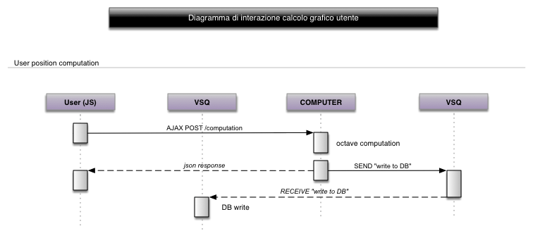

Process and protocols
=====================

Descrizione dei processi
------------------------
Ci sono tre processi che meritano una descrizione dettagliata:

* lo startup e la configurazione dinamica di un modulo computer,
* il calcolo del grafico di un utente
* la scrittura dei risultati nel DB

per il resto si tratta di un'applicazione web abbastanza standard.

Configurazione modulo computer
^^^^^^^^^^^^^^^^^^^^^^^^^^^^^^
Il modulo computer è pensato per essere indipendente, può essere utilizzato in differenti contesti.
Una volta installato e lanciato, la configurazione avviene attraverso un messaggio in broadcast (PUB-SUB),
lanciato dal server manualmente (django management task).

L'immagine mostra il pattern.

Il computer deve conoscere l'indirizzo del server che invia i comandi e il codice elezione. (es: tcp://localhost:5556)
All'avvio, il computer si mette in ascolto (SUB) sul canale equivalente al codice elezione, specificato
in configurazione (env).

Attraverso un management task sul server, si può inviare in broadcast, ai computer, un
comando di configurazione (PUB), specificando, come topic del broadcast, il codice elezione.
Nel corpo del comando è indicato l'indirizzo dove inviare la risposta al comando (status: ok) ed eventualmente l'indirizzo
dove inviare i messaggi da salvare.
La risposta viene inviata al server al termine della configurazione, attraverso il pattern PUSH-PULL.
Il management task di configurazione termina quando non sono più presenti messaggi di risposta,
o dopo un timeout adeguato.

Struttura del messaggio di configurazione
^^^^^^^^^^^^^^^^^^^^^^^^^^^^^^^^^^^^^^^^^
.. code::

    {
        header: {
            cmd: 'configure',
            reply_address: 'tcp://SERVER_HOST:REPLY_PORT'
        },
        body {
            risposte: {
                PD: { 1: 1, 2: -1, 3: -1, ... },
                PDL: { 1: -1, 2: -2, 3: 2, ... },
                ...
            },
            saver_address: 'tcp://SERVER_HOST:SAVER_PORT'
        }
    }

Struttura del messaggio di risposta alla configurazione
^^^^^^^^^^^^^^^^^^^^^^^^^^^^^^^^^^^^^^^^^^^^^^^^^^^^^^^
.. code::

    {
        computer_id: C_ID,
        response: OK|ERR,
        error_message: ""|"Messaggio di errore"
    }

Lettura configurazione dei moduli computer
^^^^^^^^^^^^^^^^^^^^^^^^^^^^^^^^^^^^^^^^^^
Seguendo un identico pattern, si può inviare a tutti i computer, per tutti i topic,
una richiesta di mostrare i dettagli della configurazione.

Richiesta in broadcast, no topic.
.. code::

    {
        header: {
            cmd: 'discover',
            reply_address: 'tcp://SERVER_HOST:REPLY_PORT'
        },
        body {
        }
    }

Risposta
.. code::

    {
        computer_id: C_ID,
        response:
        {
            election_code: 'POLITICHE_2013',
            risposte: {
                PD: { 1: 1, 2: -1, 3: -1, ... },
                PDL: { 1: -1, 2: -2, 3: 2, ... },
                ...
            },
            saver_address: 'tcp://SERVER_HOST:SAVER_PORT'
        }
    }

Calcolo del grafico di un utente
--------------------------------
Il calcolo della posizione di un utente, date le sue risposte e le risposte ai partiti, è richiesto
direttamente dal javascript al modulo **computer** attraverso una richiesta AJAX di tipo POST.

Il componente riceve le risposte dell'utente, con i suoi dati ed effettua il calcolo, usando **numpy** e **scipy**,
ottenendo le coordinate delle posizioni di utente e partiti. Poi, in modalità sincrona invia un messaggio
a una coda, per la scrittura su DB e invia la response JSON al browser dell'utente.

I dettagli della richiesta e della response::

    request url: http://computer.voisietequi.it/computation
    request method: POST
    postBody: {
      election_code: 'VSQ13',
      user_data: {
        email: 'utente@dominio.it',
        nome: 'nome utente'
      },
      risposte: { 1: -3, 2: 3, 3: 1, ... },
    }

    response:
    {
      codice_utente: 'H5033BN18',
      posizioni: {
        1:  [ 'PD', 287, 3945 ],
        2:  [ 'PDL', 3923, 1860 ],
        ...
        N: [ 'USER', 530, 1044 ],
      }
    }

Scrittura dei risultati nel DB
------------------------------
TODO