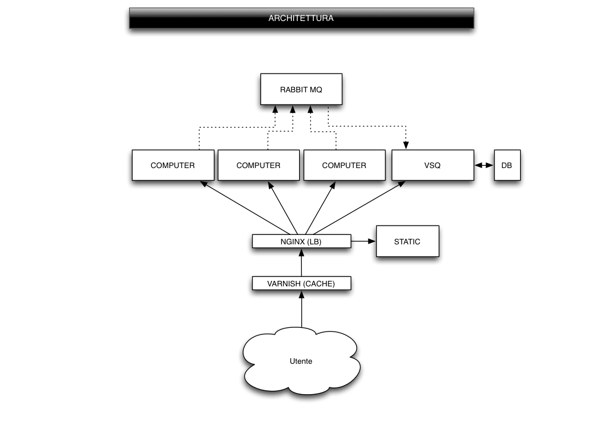

Technology
==========

.. _mds_algorithm:

The MDS algorithm
-----------------
This is where tha MDS algorithm is described, briefly, with references and other usage samples.
TODO

.. _architecture:

Architecture
------------
This is where the architectural components are described, and where we explain why (and when) the
full scalable stack should be used, or a simpler one-machine configuration may suffice.

Under heavy load (hundreds of contemporaneous requests), the  application must be able to
respond within few tenths of a second.
We use the full scalable stack, sketched in the schema below.

The **vsq** module is the main application, in charge of dynamically building all the html pages of the web-site. It is a `postgres`_-based `django`_ application.

.. _django: http://www.djangoproject.com/
.. _postgres: http://www.postgresql.org/

The **computer** module is in charge of :ref:`mds_algorithm`'s computation. It can be highly parallelized, in order to receive
many requests contemporaneously. It is a lightweight `web.py`_ application, dynamically and remotely configurable.
Its task is to compute the position of a user, given the set of positions of the parties and return a response.

It is reached directly by the http-client (browsers), through ajax requests.

All results are sent back to the database through a messaging infrastructure.
The system is using `rabbitmq`_ as of now, a switch to `0mq`_ is foreseen in the near future.

This allows the write-operations in the DB to be duly queued, increasing the scaling capability of the whole system.

Both the **vsq** and the **computer** modules are served by the `uwsgi`_ application server, and `nginx`_ is used ad a load balancer
to distribute load among processes and machines, as needed.

*nginx* is also used to serve static content.

`varnish`_  acts as a cache-server and reverse proxy and is the main server listening on the standard HTTP (80) port.
This will reduce the number of requests that pass through the stack, softening the burden on the other components,
and increasing availability.

.. _web.py: http://webpy.org/
.. _nginx: http://wiki.nginx.org/Main
.. _rabbitmq: http://www.rabbitmq.com/
.. _0mq: http://www.zeromq.org/
.. _uwsgi: http://projects.unbit.it/uwsgi/
.. _varnish: https://www.varnish-cache.org/

Under conditions of low-load, the full stack can be reduced to just a **vsq** and **computer**
component, running on a single machine.
By using **0mq** the complexity of setting up and configuring a **rabbitmq** component will be eliminated and this scal-down solution
will be more efficient.

